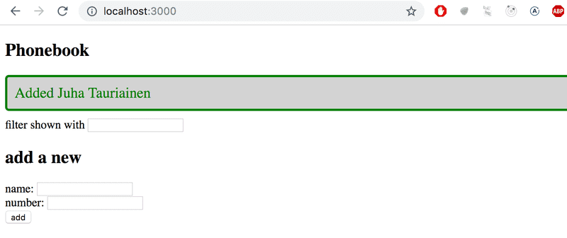

# [Phonebook](https://fullstackopen.com/en/part2/adding_styles_to_react_app#exercises-2-16-2-17) 

Phonebook application. User can remove, add, update and filter contacts.



## Run the application 

```bash
# Git clone the repository then navigate to its root
# Install NPM packages
$ npm install
# Start the application
$ npm run dev
```
